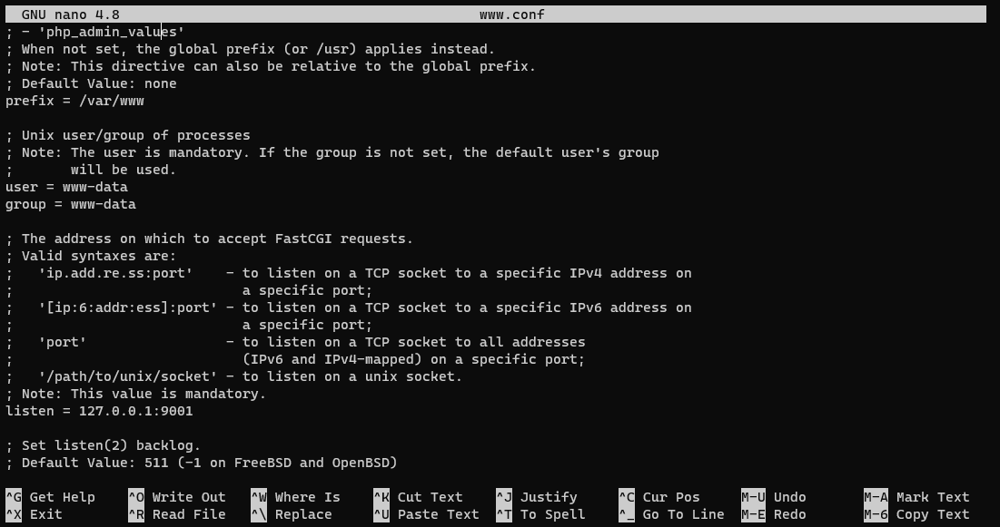
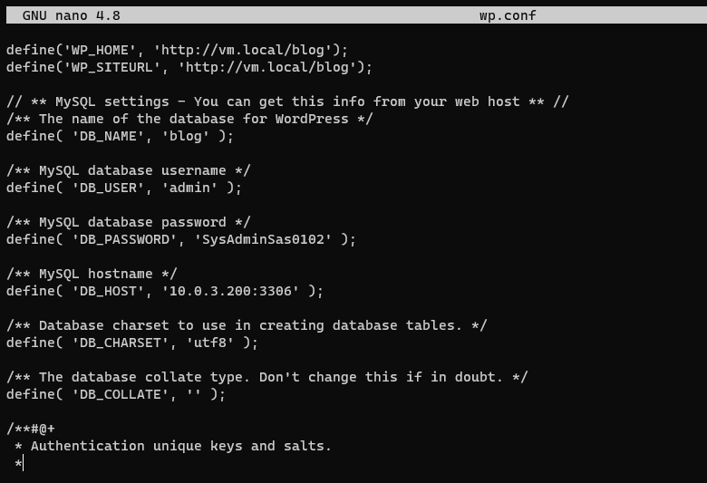

# Report Module 2

**From Group 6 [ IT 02-02 ]**

**Gede Reyki Astika   1202190052 || Ignatia Indreswari  1202190022**

------

## Step by Step

------

We need to change lxc_landing and lxc_php7 from ubuntu 18.04 to ubuntu 20.04 (from bionic to focal)

```
sudo lxc-destroy ubuntu_landing

sudo lxc-destroy ubuntu_php7.4

sudo lxc-create -n ubuntu_landing -t download -- --dist ubuntu --release focal --arch amd64 --force-cache --no-validate --server images.linuxcontainers.org

sudo lxc-create -n ubuntu_php7.4 -t download -- --dist ubuntu --release focal --arch amd64 --force-cache --no-validate --server images.linuxcontainers.org
```

Set IP

ubuntu_landing : 10.0.3.103/24

ubuntu_php7.4 : 10.0.3.101/24

To set the IP for each containers we need to start and enter, then open netplan to set the IP

```
#ubuntu_landing
sudo lxc-start -n ubuntu_landing
sudo lxc-attach  -n ubuntu_landing
apt update; apt upgrade -y; apt install -y nano
nano /etc/netplan/10-lxc.yaml
netplan apply

#ubuntu_php7.4
sudo lxc-start -n ubuntu_php7.4
sudo lxc-attach  -n ubuntu_php7.4
apt update; apt upgrade -y; apt install -y nano
nano /etc/netplan/10-lxc.yaml
netplan apply
```

------

### vm.local/

Install laravel with ansible

------

- [ ]  First we need to enter to `cd ~/ansible/modul2-ansible` and then we need to make file with the name install-laravel.yml


```
nano install-laravel.yml

#Inside install-laravel.yml
---
- hosts: ubuntu_landing
  vars:
    username: 'admin'
    password: 'SysAdminSas0102' #DON'T FORGET TO CHANGE
    domain: 'lxc_landing.dev'
  roles:
    - php
    - lv
```


- [ ]  After that we need to make directories for tasks and handlers in folder php, and then enter tasks main.yml to install packages

```
mkdir -p roles/php/tasks
mkdir -p roles/php/handlers
cd roles/php/tasks
nano main.yml
```


- [ ]  Then enter handlers main.yml to restart php


- [ ]  After that we need to make directories for tasks, templates, and handlers in folder lv, and then enter tasks main.yml to install package laravel and composer


```
mkdir -p roles/lv/tasks
mkdir -p roles/lv/templates
mkdir -p roles/lv/handlers
cd roles/lv/tasks
nano main.yml
```


No Interaction is used because so that the system do not ask any interactive question


- [ ]  Then enter templates env.template (This is laravel configuration)

```
cd roles/lv/templates
nano env.template
```


- [ ]  After that we need to enter templates lv.conf for nginx configuration

```
nano lv.conf
```


- [ ] Then we have to enter handlers main.yml to restart php and nginx

```
cd roles/lv/handlers
nano main.yml
```


- [ ]  After that we run ansible playbook

```
ansible-playbook -i hosts install-laravel -k
```


- [ ]  YAY! It's installed. We not finished yet, we need to check it. Open `http://vm.local/` in web browser


- [ ] Yeayyy... Laravel is working

------

### Soal Responsi

no 2

------

- [ ] Rubah php sock dari /run/php/php7.4-fpm.sock ke 127.0.0.1:9001

- [ ] Enter modul2-ansible, then enter to roles/lv/tasks, and then main.yml. We add www.conf

```
cd roles/lv/tasks
nano main.yml
```


- [ ] Change from fastcgi_pass unix to fastcgi_pass 127.0.0.1:9001

```
cd roles/lv/templates
nano lv.conf
```


- [ ] Then make a folder 'www.conf'. Change the prefix to /var/www and listen to 127.0.0.1:9001

```
nano www.conf
```



- [ ] After changing the templates, we went to handlers and make sure it have restart php and restart nginx. Done? then start ansible playbook install laravel

```
ansible-playbook -i hosts install-laravel.yml -k
```


- [ ] We go to web browser, and it works :)


------

### vm.local/blog

Install wordpress with ansible

------

- [ ]  we need to enter to `cd ~/ansible/modul2-ansible` and then we need to make file with the name install-wp.yml


```
nano install-wp.yml

#Inside install-wp.yml
---
- hosts: ubuntu_php7
  vars:
    username: 'admin'
    password: 'SysAdminSas0102' #DON'T FORGET TO CHANGE
    domain: 'lxc_php7.dev'
  roles:
    - wp
```


- [ ]  After that we need to make directories for tasks, templates, and handlers in folder wp, and then enter tasks main.yml to install packages

```
cd roles/wp/tasks
nano main.yml
```


we need to install wget because with wget we can use it to retrieve content and files from various web servers. The name is a combination of World  Wide Web and the word get. It supports downloads via FTP, SFTP, HTTP, and HTTPS. And because wget is usable on any Unix system. We can use wget command to download the content of an entire site, in our case is WordPress.


- [ ]  Then enter templates wp.conf (This is wordpress configuration)


```
cd roles/wp/templates
nano wp.conf
```



- [ ]  After that we need to enter templates wp.local for nginx configuration

```
nano wp.local
```


- [ ]  Then we have to enter handlers main.yml to restart php and nginx

```
cd roles/wp/handlers
nano main.yml
```


- [ ]  After that we run ansible playbook

```
ansible-playbook -i hosts install-wp -k
```


- [ ]  YAY! It's installed. We not finished yet, we need to check it. Open `http://vm.local/blog/` in web browser


- [ ]  Finallyyyyy it's done.

------

## Thank You

- [x]  Laravel (vm.local/) DONE
- [x]  WordPress (vm.local/blog) DONE
- [x]  Soal Responsi (no 2) DONE

------

