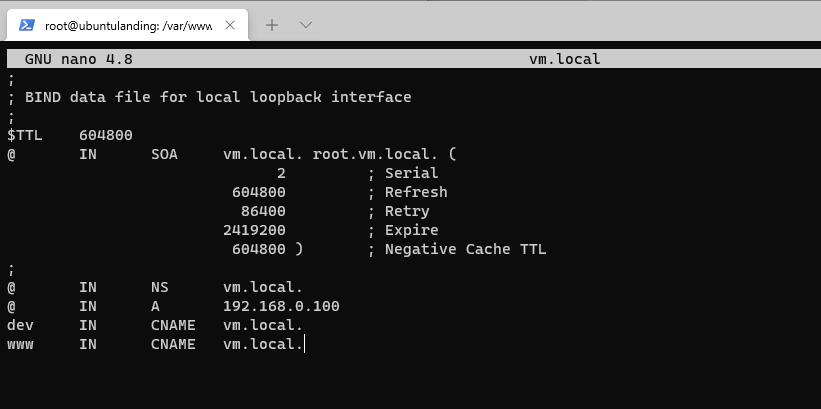

# Report Module 3

**From Group 6 [ IT 02-02 ]**

**Gede Reyki Astika   1202190052 || Ignatia Indreswari  1202190022**

------

## Step by Step

------

Make 'dev.vm.local' subdomain using ansible

Register 'dev.vm.local' subdomain to DNS

Go to

```
cd ~/ansible/modul2-ansible
cd roles/php/tasks
cd main.yml
```

Here we added 'bind9 and dnsutils'


After that we go to

```
cd roles/lv/tasks
cd main.yml
```

Here we added tasks such as  'Creates directory, Copy conf.local, Copy vm.local, Copy 0.168.192, Copy resolv.conf, and Copy named.conf.options'


After done, we go to

```
cd roles/lv/templates
nano 0.168.192.in-addr.arpa
nano named.conf.local
nano named.conf.options
nano  resolv.conf
nano vm.local
```


Then we go to handlers to add restart bind

```
cd roles/lv/handlers
nano main.yml
```


We run ansible playbook

```
ansible-playbook -i hosts install-laravel.yml -k
```


Success!

After that we add 'dev.vm.local' in

```
sudo nano /etc/hosts
```


And then we go to


enter nano vm.local, then add 'www IN CNAME vm.local.'



After that we must restart

```
sudo /etc/init.d/named restart
host -t CNAME www.vm.local
```

We succeed :)


