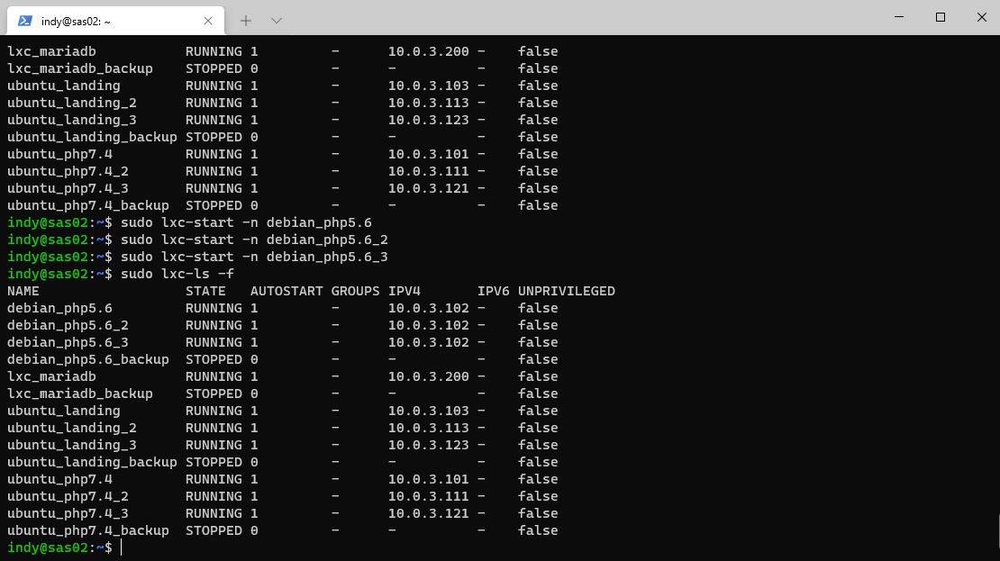

# Report Module 4

**From Group 6 [ IT 02-02 ]**

**Gede Reyki Astika   1202190052 || Ignatia Indreswari  1202190022**

------

## Step by Step

------

Make 2 copies of each containers


Then start each containers


Go to 'ubuntu_php7.4_2', then change the IP address to '10.0.3.111' so that differ from 'ubuntu_php7.4'. Same as 'ubuntu_php7.4_3' change the IP address to '10.0.3.123'


Go to etc/hosts to register 'lxc_php7_2.dev'


Then change the server name


Restart nginx then curl it. Repeat the same steps for 'ubuntu_php7.4_3'


Same as ubuntu_php7.4 we need to start all container



Go to 'debian_php5.6_2' and change the IP address to '10.0.3.112'. The same for 'debian_php5.6_3' and change the IP address to '10.0.3.122'


Register 'lxc_php5_2.dev' at /etc/hosts


change the server name, then repeat the same steps for 'debian_php5.6_3'. don't forget to restart the container


Register all the contaiers in /etc/hosts (on vm)


Run the jmeter. Change the number of threads from user access from 50, 100, 150


Then we went back to VM than go to

```
/etc/nginx/sites-available/vm.local
```

to add upstream landing, php5, and php7


change the proxy_pass


Then we go back to the jmeter and redo it


Analysis

Below is the results from when we use load balancer and not using the load balancer

 - When there is 50 users that access our web, if we don't use load balancer the average time of user accessing our web is
   - landing : 2444 ms / 2.4 s
   - blog : 2347 ms / 2.3 s
   - app : 19 ms / 0.019 s
- When we use load balancer, then
  - landing : 1841 ms / 1.8 s
   - blog : 1379 ms / 1.3 s
   - app : 12 ms / 0.012 

Here we can know that the average time of user accessing our web is faster then if we don't use load balancer. For the throughput or the amount of user accessing our web is

- When there is 50 users that access our web, if we don't use load balancer the amount of user accessing our web is

  - landing : 16 user / second
  - blog :  12 user / second
  - app : 22 user / second

- When we use load balancer, then

  - landing : 42 user / second
  - blog :  29 user / second
  - app : 30 user / second

  Here we can know that the average time of amount of user accessing our web in 1 second is faster then if we don't use load balancer.

  

  The conclusion is, if we use load balancer, then the time is faster and the amount of users that accessing our web is much more then when we don't use load balancer.

  
